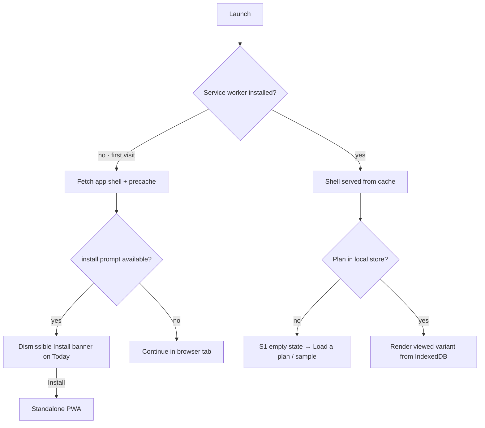
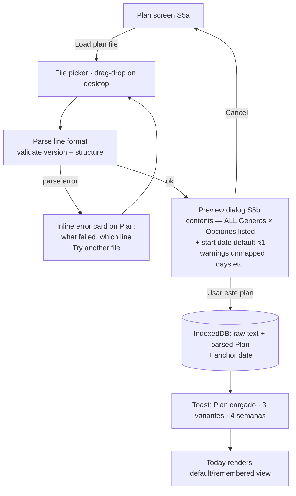
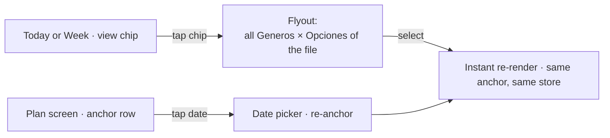
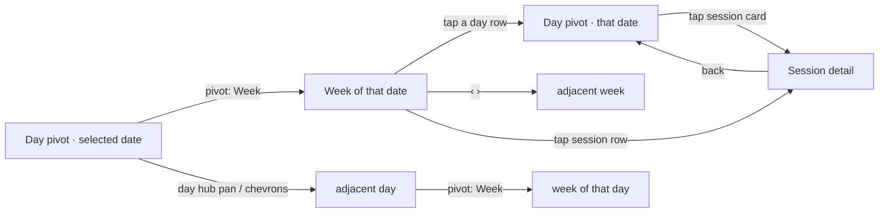
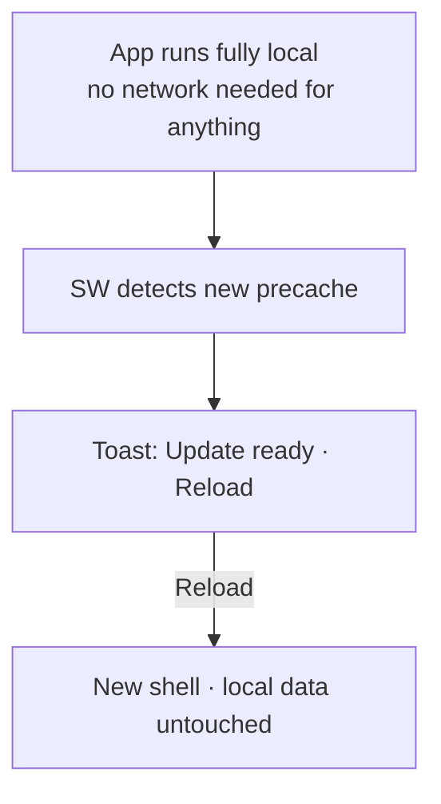

# Briple Training — Storyboards & Flows (V1)

> Working title, placeholder. Personal training PWA built on Fable.Ripple + Metrino (Metro design language).
> **Status:** design only — no code yet.
> **Primary device:** phone (in-browser or installed PWA). Desktop is a responsive adaptation — every decision is made mobile-first.
> **Format:** the line-based plan format (`plan_entrenamiento_4sem.txt` + the F# `Plan` types) is the design's input. See §7.

---

## 1. Scope

### V1 — what we're designing

1. **Load a plan file** — parse the line format and import **everything in it**: all Generos, all Opciones, all semanas, the extras. Nothing is chosen away or discarded at import.
2. **Display it** — calendar-like view: *today's session* by default, expandable to *the week*; the **view** (which Genero × Opcion you're looking at) is a browsing choice, switchable instantly.
3. **Local-first** — shell cached, everything stored on-device; offline is the *normal mode*, so it gets no banner. The one network-facing state we keep is the **update** notice.

### Explicitly out of scope (confirmed)

- Session logging / "done" markers / start-session runner — *irrelevant for now*
- Editing imported sessions or authoring plans
- Cloud sync, accounts (V1 is single-device local-first)
- Progress/history analytics, month calendar (V2)

### Resolved decisions

| Question | Decision |
|---|---|
| Multiple plans / variants | **The file is imported whole.** Every Bloque (Genero) and every Opcion ("3dias", "5dias"…) stays browsable. Which one you're *looking at* is app state (the **view chip**), switchable in one tap — not an import-time choice. A new *file* replaces the active one; the previous stays in local history. |
| View selection (Género/Opción) | A chip under the date header ("Hombre · 3 días ▾") opens a flyout listing **all** variants found in the file, grouped by Genero. Selecting re-renders instantly — same anchor, same store. Default view: first Genero's first Opcion, then remembered. |
| Week start / locale | **Device locale** (`Intl`): weekday/month names, first day of week, date formatting. Parsing maps the format's day names ("Lunes"…) via a fixed es/en name table — display is always localized. |
| Plan start day (anchor) | The format establishes **no start day** — when the plan begins is the **user's decision** (pending in the format; see §8). Default: plan weeks start on **Monday**, and the picker pre-selects **this week's Monday if the viewed variant trains today, else next week's Monday**. Evaluated against the variant's real session days, so 6/7-day plans and Saturday/Sunday sessions (mar·jue·sáb, mié·vie·dom) resolve correctly. Editable at import (S5b) and later from Plan (F2b). |
| Offline notice | **None.** All data is local; being offline changes nothing, so there is nothing to announce. The **update** notice stays: SW precache → toast with Reload (S6). |
| "Done" tracking | Dropped from V1 entirely (no DONE badges anywhere). |
| Theme | Tokens follow `prefers-color-scheme`; manual override via `data-theme` on `<html>` and optional accent via `accent` attribute (21 named colors) — exactly as metrino's README specifies. Landed in Settings (V1.1 for the UI, the mechanism is trivial). |
| Start session | Removed from all screens. Session detail ends with the content. |

---

## 2. Metro principles, applied to this app

| Principle | In this app |
|---|---|
| **Content over chrome** | **No top bar, no hamburger, no kebab menu** — a page's title *is* its content header, in the Metro type ramp. The app bar holds commands, never navigation (Windows Phone model): the `⋯` menu reaches the Plan and Settings pages, and every page returns via back (system back, or the chevron). |
| **Typography is the UI** | Metrino type ramp carries hierarchy (below); display text stays light (300). |
| **Accent discipline** | `--metro-accent` only for: selected day, today marker, current view chip, circuit headers, primary action, active pivot. Never decoration. |
| **Alive with motion** | Pivot selection is a tap: content slides on `--metro-transition-slow` (333ms), headers move at 167ms. Expand/collapse and controls use `--metro-transition-normal` (250ms) and fast (167ms) with metrino's easing. |
| **Authentically digital** | Empty, parse-warnings, "before/after the plan", update-ready — all visible states, not popups. Offline is *not* a state: it's the mode. |
| **4px grid** | All spacing from `--metro-spacing-xs..xxl`. Touch targets: 34px recommended, 26px minimum (Windows Phone 7 UI guide). |

### Type ramp (metrino `typography.css` → this app)

| Ramp | Token / size | Used for |
|---|---|---|
| Display (56 light) | `--metro-font-size-hero` | The day number on Today |
| Title (42 light) | `.title` | Screen titles (Today's date block, Plan) |
| Subheader (26 light) | `.subheader` | Session title on detail |
| Header (28 light) | `.header` | Week range heading |
| Body (15) | `.body` | Exercise names |
| Normal (14) / Medium (16) | tokens | Meta lines, set schemes (`6-8 · RIR 1-2 · 3 min`) |
| Caption (12) | `--metro-font-size-small` | Secondary meta, cue lines |
| Badge (11 bold) | `.badge` | Chips: view, circuit headers, step labels |

Theme: metrino follows `prefers-color-scheme` and has no default of its own. Manual override = `data-theme="light|dark"` on `<html>`, accent = `accent="teal"` (21 names, `AccentColor` DU already bound in Metrino.Ripple). Both persist locally.

---

## 3. Information architecture

```
Hub and spokes (no top chrome, no persistent nav bar — app bars hold commands)
├── Today (home)     ← landing screen. Date block + view chip + pivot [Day | Week]
│    │                  app bar: ⋯ menu (Plan · Settings)
│     └── Session detail   (page; back chevron; circuits, RIR, rests)
├── Plan (page)      ← back chevron. what's in the file (all variants), guía (extras),
│    │                  imports/history, load file, re-anchor
│    │                  app bar: Load file + ⋯ menu (export copy · remove plan)
│     └── Import preview dialog
├── Progress         ← V2 (hidden in V1)
└── Settings (page)  ← back chevron. theme (system/light/dark), accent, install; V1.1+
```

Navigation follows the Windows Phone model: Today is the hub; Plan and Settings are spokes reached from the ⋯ menu. Back is the system back gesture, with a chevron in the page header where no system back exists (browser tab). The app bar itself holds commands, not navigation.

Every screen reads from the local store; nothing in V1 needs the network after first install — and no screen says so, either.

---

## 4. Storyboards

Phone frames are 1:1 layout sketches (32-char canvas ≈ 390dp). Content in the frames comes from the real sample file; UI chrome strings go through the device locale. Example state: **plan anchored Monday 7 Sep 2026, today is Monday 14 Sep → "Semana 2 de 4"**.

### 4.1 First run — no plan loaded  `S1`

```
┌────────────────────────────────┐
│  MONDAY · 14 SEPTEMBER         │ caption, localized
│  14                            │ display 56, light
│  Week 38 · Q3                  │ body, secondary
│                                │
│  ┈┈┈┈┈┈┈┈┈┈┈┈┈┈┈┈┈┈┈┈┈┈┈┈┈   │
│                                │
│   Your calendar is empty.      │ body
│   Load a training plan file    │
│   to see your sessions here.   │
│                                │
│   ┌──────────────────────┐     │
│   │     Load a plan      │     │ accent, primary
│   └──────────────────────┘     │
│   ┌──────────────────────┐     │
│   │  Try the sample plan │     │ bundles the fixture file
│   └──────────────────────┘     │
│                                │
├────────────────────────────────┤
│  ⋯                             │ app-bar menu: Plan · Settings
└────────────────────────────────┘
```

The date header renders even with no data — the calendar is the product, empty or not. "Try the sample plan" runs the same import flow against a bundled fixture (the 4-week circuit file), which doubles as the dev path while the format matures. On first-ever visit only, a slim dismissible banner offers **Install app** (F1).

### 4.2 Today — Day pivot (default)  `S2`

```
┌────────────────────────────────┐
│  MONDAY · 14 SEPTEMBER         │ caption, localized
│  14                            │ display 56, light
│  Semana 2 de 4 · RIR 2-3       │ plan week + mesociclo target
│  Hombre · 3 días            ▾  │ view chip → flyout (all variants)
│                                │
│  Day      Week                 │ pivot — the enclosing component;
│ ═══════════──────────────────  │   day navigation lives inside Day
│         ‹  ›                   │ chevrons scroll the day hub
│  MON                           │ day hub: one section per day of
│ ┃ Full Body A        ┃ TUE     │ the week; selected header in
│ ┃ 6 EJERCICIOS · 2 CIRCUITOS   │ accent; pan or chevron moves the
│ ┃ ──────────────────────────── │ day; the next day peeks at the edge
│ ┃ Sentadilla con barra         │ the FULL routine, flat — every
│ ┃     6-8 · RIR 1-2 · 3 min    │ exercise of the day with its
│ ┃ Press banca                  │ scheme; no "+ más" line
│ ┃     6-8 · RIR 1-2 · 3 min    │
│ ┃ Remo con barra               │
│ ┃     8-10 · RIR 1-2 · 3 min   │
│ ┃ Press militar                │
│ ┃     8-12 · RIR 1-2 · 2-3 min │
│ ┃ Curl femoral tumbado         │
│ ┃     10-15 · RIR 0-1 · 2 min  │
│ ┃ Elevaciones laterales        │
│ ┃     12-20 · RIR 0-1 · 90 s   │
│ ┃                     tap →    │ the whole card opens the plan
│                                │ detail: circuits, mesociclo, guía
│                                │
├────────────────────────────────┤
│  ⋯                             │
└────────────────────────────────┘
```

Notes:

- **View chip** — "Hombre · 3 días ▾" opens a `metro-menu-flyout` listing every variant in the file, grouped by Genero (*Hombre: 3 días — Full Body A/B/C · 5 días — Mixtos; Mujer: 5 días — Inferior/Superior*). Selecting one re-renders the day hub, week rows, and session content instantly — nothing is re-imported, nothing discarded. The chip is the only place Género/Opción appear on Today.
- **"Semana N de M"** is the plan's own week counter (anchor + N−1 weeks), shown under the date — calendar week and plan week are both visible at all times. `RIR 2-3` comes from the file's `#x mesociclo` for that week (structured extraction, §7; absent → line omitted).
- **Day hub** (slice 3b revision): one `metro-hub` section per day of the week lives *inside* the Day pivot item — the old strip row sat outside the pivot and showed day controls in the Week view, which broke containment. Headers come from the device locale; the selected section's header takes the accent. Pan, chevrons, and header taps all agree on one `selectedDate`.
- **The card shows the complete routine for the day** (criteria revision 2026-09-20): every exercise with its scheme line, flat — no circuit ids, no "+ N más" truncation. The whole card is a tap target → Session detail (S4), which is where mesociclo context, circuit grouping, rests, and guía lines live.
- **Rest day** variant: quiet centered line — *"Descanso · próxima sesión: Miércoles, Full Body B"* — never an error look. Rest days fall out of the projection naturally (weekday not in the variant's `Dias`).

### 4.3 Today — Week pivot (the "expand")  `S3`

```
┌────────────────────────────────┐
│  14 – 20 SEPTEMBER             │ header 28 light, locale format
│  Hombre · 3 días            ▾  │ same view chip, same flyout
│  Semana 2 de 4   ‹   ›    Hoy  │ plan-week chip + week nav + jump
│                                │
│  Day      Week                 │
│ ──────────═══════════════════  │
│ ────────────────────────────── │
│  14  lun   Full Body A   6 ej  │
│  15  mar   ·  descanso         │
│  16  mié   Full Body B   6 ej  │
│  17  jue   ·  descanso         │
│  18  vie   Full Body C   6 ej  │
│ ▌19  sáb   ·  descanso         │ accent bar = today
│  20  dom   ·  descanso         │
│                                │
│  3 sesiones esta semana        │ summary, secondary
├────────────────────────────────┤
│  ⋯                             │
└────────────────────────────────┘
```

Notes:

- **Phone week = vertical day rows**, not 7 columns (titles wouldn't fit). Each row: date number, localized weekday, session title + exercise count (or `· descanso`). Today carries the accent bar + highlight.
- Switching the view chip re-fills the rows for that variant — e.g. *Mujer · 5 días* fills Lun–Vie with the tren inferior/superior titles.
- The plan-week chip lives in the week header: before the anchor → *"Empieza el 7 sept"*; after anchor + 4 weeks → *"Plan completado"* quiet state (F3).
- Tapping a row collapses back to **Day** with that date selected — expand/collapse is symmetric (F3).
- No DONE badges (out of scope); rows show *planned* info only.

### 4.4 Session detail — circuits, RIR, rests  `S4`

```
┌────────────────────────────────┐
│ ‹ MIÉRCOLES · 16 SEPTEMBER     │ back: system back where it
│  Full Body B                   │ exists; chevron otherwise
│  SEMANA 2 DE 4 · RIR 2-3       │ badge line
│ ────────────────────────────── │
│  CIRCUITO A · 4 VUELTAS        │ circuit header (badge, accent)
│  A1  Peso muerto rumano        │
│      8-10 · RIR 1-2 · 3 min    │
│  A2  Press inclinado c/manc.   │
│      8-12 · RIR 1-2 · 2-3 min  │
│  A3  Jalón al pecho            │
│      8-12 · RIR 1-2 · 2-3 min  │
│ ────────────────────────────── │
│  CIRCUITO B · 3 VUELTAS        │
│  B1  Zancadas búlgaras         │
│      10-12 · RIR 1-2 · 2 min   │
│  B2  Curl de bíceps con barra  │
│      10-15 · RIR 0-1 · 90 s    │
│  B3  Extensión de tríceps      │
│      10-15 · RIR 0-1 · 90 s    │
│ ────────────────────────────── │
│  · Entre circuitos: 2-3 min    │ guía line (from extras, if parsed)
│  · Los circuitos alternan      │
│    patrones antagonistas       │
└────────────────────────────────┘
```

Notes:

- **The detail adds what Today omits** (criteria revision 2026-09-20): Today's card lists the full routine flat; this screen shows the same routine *as a plan* — the mesociclo badge, circuit grouping with the `A1/B1` idiom, circuit headers, rests, and guía lines.
- **Circuits are the primary grouping** — the format's `Circuito` (A/B) + `Vueltas` render as a badge-style header per group; `Orden` becomes the gym-standard `A1/A2/B1` idiom. A heavier divider separates circuits; exercises inside a circuit are separated by spacing alone (they belong together — that's what a circuit *means*).
- **Every field renders verbatim**: `Reps` ("6-8", but also "30-45 s" or "10-15 reps por ronda" — time-based work shown as-is), `Rir` (omitted when `"-"`), `Descanso`, `Notas` (caption line under the scheme when non-empty).
- The trailer lines under the last circuit come from `#x regla-circuito` / `#x descansos` — one or two, not the whole list (full text lives in Plan → Guía).
- Back returns to wherever you came from (Day or Week). The detail screen has no view chip — it always shows the variant it was opened from.

### 4.5 Plan — what's in the file, guía, imports  `S5a`

```
┌────────────────────────────────┐
│ ‹ Plan                         │ back chevron; title 42 light
│                                │
│  Plan de Entrenamiento en      │ #meta titulo · semanas
│  Circuito · 4 semanas          │
│  origen: …Circuito_4_Semanas   │ #meta origen (caption)
│                                │
│  VARIANTES EN EL ARCHIVO       │ all of them — nothing discarded
│  ▌Hombre · 3 días    A/B/C     │ tap = view it in Today
│   Hombre · 5 días    mixtos    │ accent bar = currently viewed
│   Mujer  · 5 días    inf/sup   │
│                                │
│  Inicio del plan: lun 7 sep    │ anchor — tap to re-anchor (F2b)
│                                │
│   ┌──────────────────────┐     │
│   │    Load plan file    │     │ accent
│   └──────────────────────┘     │
│                                │
│  GUÍA DEL PLAN                 │
│  ▸ Mesociclo · RIR por semana  │ ── #x extras, grouped by key,
│  ▸ Reglas de circuito          │    metro-expander sections
│  ▸ Progresión · Descansos      │
│  ▸ Recuperación · Deload       │
│                                │
│  IMPORTS                       │
│  · plan_4sem.txt  ✓ ok   hoy   │ current (history re-loadable)
├────────────────────────────────┤
│  ⋯                             │ menu: export copy · remove plan
└────────────────────────────────┘
```

The file's `#x` extras are real user value (mesociclo RIR targets, progression rules, deload signals, recovery checklist) — they render as expander sections under "Guía del plan", grouped by their key. Nothing from the file is thrown away at import: the variant list shows every Genero × Opcion found, and tapping one switches the view and jumps to Today.

### 4.6 Import — preview: everything found + start date  `S5b`

```
┌────────────────────────────────┐
│  ┌─ Importar plan ──────────┐  │ metro-content-dialog
│  │ plan_4sem.txt · ✓ parse  │  │ full-bleed on phone
│  │                          │  │
│  │  Plan de Entrenamiento   │  │
│  │  en Circuito · 4 semanas │  │
│  │                          │  │
│  │  HOMBRE                  │  │ everything the file contains,
│  │   · 3 días — A/B/C       │  │ listed — not a choice to make
│  │   · 5 días — mixtos      │  │
│  │  MUJER                   │  │
│  │   · 5 días — inf/sup     │  │
│  │                          │  │
│  │  ¿CUÁNDO EMPIEZA?        │  │
│  │  Inicio: [lun 14 sep ▾]  │  │ default per §1; user's call
│  │                          │  │
│  │  ⚠ 1 día no reconocido   │  │ warnings inline, honest
│  │    ("Sábado", semana 2)  │  │
│  │                          │  │
│  │ [Usar este plan][Cancelar]│
│  └──────────────────────────┘  │
└────────────────────────────────┘
```

The dialog shows **what was imported, all of it** — variants are listed per Genero as facts, not radios. The single decision the format forces is the **start date** (the file is date-free by design): pre-filled with the §1 default, fully editable. While parsing: `metro-progress-ring` + "Reading plan…". On commit: toast *"Plan cargado · 3 variantes · 4 semanas"*, Today renders the default/remembered view (F2). Nothing touches the store before the user sees the contents, warnings, and start date.

### 4.7 Update state  `S6`

```
 update available
┌────────────────────────────────┐
│  ✓ Update ready     [Reload]   │ inline state — never auto-reload
│                                │
│  MONDAY · 14 SEPTEMBER         │
│  14                            │
│  Semana 2 de 4 · RIR 2-3       │
│  Hombre · 3 días            ▾  │
│  ┃ Full Body A                 │
│  ┃ …                           │
│                                │
├────────────────────────────────┤
│  ⋯                             │
└────────────────────────────────┘
```

- There is **no offline banner** — the app is fully local, and offline is its normal operating mode (§7). Nothing about the UI changes when the network does.
- **Update**: the SW detects a new precache → `metro-toast` announces it (toasts have no action button) and a quiet inline **Reload** state appears on Today until used. Never auto-reload: the phone may be mid-session in a gym with bad signal.

### 4.8 Desktop adaptation  `S7` — responsive, same product

```
┌────────────────────────────────────────────────────────────────────────┐
│      MONDAY · 14 SEPTEMBER                                             │
│      14                                                                │
│      Semana 2 de 4 · RIR 2-3                                           │
│      Hombre · 3 días                                              ▾    │
│                                                                        │
│      ‹[L]  M   X   J   V   S   D ›                                     │
│      Day      Week                                                     │
│     ═══════════──────────────────                                      │
│       ┌────────────────────────┐  ┌───────────────────────┐            │
│       ┃ Full Body A            │  │ next / recent context │            │
│       ┃ A1 Sentadilla  6-8     │  │ (upcoming session,    │            │
│       ┃ A2 Press banca 6-8     │  │  semana progress)     │            │
│       └────────────────────────┘  └───────────────────────┘            │
│                                                                        │
├────────────────────────────────────────────────────────────────────────┤
│  ⋯                                              menu: Plan · Settings  │
└────────────────────────────────────────────────────────────────────────┘
```

| | Phone (< 720px) — primary | Desktop (≥ 720px) |
|---|---|---|
| Shell | Bottom app-bar (thumb reach); `⋯` menu on every page | Same app bar; content centered on a max-width grid |
| Week pivot | Vertical day rows | `metro-grid` 7 columns, same data |
| Session detail | Full-bleed page | Centered column, max ~640px content width |
| Import preview | Full-bleed dialog | Centered `metro-content-dialog` |
| Day hub | `metro-hub` + chevron buttons | Same |

Rule: the phone layout is the design of record; desktop only adds room. No desktop-only interactions; content stays centered on a max-width grid so big screens look composed, not stretched.

---

## 5. Flows

### F1 — First launch & install



Install is offered, never nagged: banner dismissible (remembered locally); an **Install app** command lives in Settings once seen.

### F2 — Load a plan file (core V1 flow)



Decisions locked by the format:

- **Import imports everything.** The whole `Plan` — both Generos, every Opcion, all semanas, all `#x` extras — is parsed and stored. No variant selection happens at import or ever *commits*: what you see is the **view** (below), and switching it is free.
- **The view is app state, not data.** `{ Genero, OpcionId }` selects which variant the calendar renders (chip on Today/Week, variant list on Plan). It's remembered across launches and never mutates the store.
- **The only commit-time decisions** are the file itself and its start date (§1 default, user's call), plus honest warnings (e.g. a day name the es/en table doesn't recognize → that day is skipped and reported).
- **New file replaces, but keeps history**: the previous import's raw text + parsed plan stay in the local `IMPORTS` list (S5a), one tap to restore. "Multiple plans" across files is thereby deferred without being closed off.

### F2b — Switch view / re-anchor



Switching *Hombre · 3 días* → *Mujer · 5 días* changes dots, rows, and content instantly; nothing is imported, committed, or lost. Re-anchoring re-projects every view at once (the anchor belongs to the file, not to a variant).

### F3 — Day ⇄ Week navigation (symmetric expand/collapse)



State rule: exactly one `selectedDate` in app state. Day renders it; Week renders its week; plan-week chip derives from the file's anchor. Outside the plan range the screens degrade to quiet "antes del plan / plan completado" states, never errors. (Pinch / `metro-semantic-zoom` as an alternative expand gesture: V2 nice-to-have — the pivot covers the need.)

### F4 — Update lifecycle



No offline branch: all data and rendering are local, so network loss is unobservable to the UI. The only network-facing state is the update notice.

---

## 6. Metrino component mapping

All bound in Metrino.Ripple (`registerMetroXxx` + `Html.metroXxx`):

| Purpose | Component | Notes |
|---|---|---|
| Page commands (phone + desktop) | `metro-app-bar` (+ `-button`) | Bottom bar. Commands only; `⋯` menu reaches Plan/Settings and export/remove |
| View chip → variant selector | `metro-menu-flyout` | Grouped by Genero; instant switch |
| Day / Week switch | `metro-pivot` + `metro-pivot-item` | Tap selection; content slide 333ms (slow token), headers 167ms |
| Day hub | `metro-hub` + `metro-hub-section` | The pivot cannot pan; the hub is the pan surface. Selected header = accent |
| Week rows (phone) | plain rows (`metro-stack-panel`) | list-view renders text only; rows need markup. Row tap → Day |
| Week grid (desktop) | `metro-grid` | 7 columns |
| Session / exercise layout | `metro-stack-panel`, `metro-border` | Accent rule on card; hairlines inside |
| Start date | `metro-date-picker-roller` (phone) / `metro-date-picker` | WP-style roller suits one-hand use |
| Guide sections (extras) | `metro-expander` | Grouped by `#x` key |
| Import preview | `metro-content-dialog` | Contents + start date + warnings |
| Destructive confirm (replace file) | `metro-message-dialog` | |
| Parse progress | `metro-progress-ring` | Indeterminate |
| Toasts (loaded, update) | `metro-toast` | No action button. Update: persistent toast + inline Reload state on Today |
| Commands overflow | `metro-menu-flyout` | Export copy, remove plan |
| Icons | `metro-icon` | 131-name map |
| Theme / accent (Settings V1.1) | `data-theme` + `accent` attributes | Per metrino README; `AccentColor` DU bound |
| Month calendar (V2) | `metro-calendar` / `metro-calendar-date-picker` | Already bound when needed |

Deliberately unused in V1: `metro-info-bar` (no offline notice — nothing to announce), `live-tile` family, `semantic-zoom`, `hub`/`panorama`, `metro-split-view` (nav pane is a later era pattern).

---

## 7. Data & offline architecture

### The format IS the display model

The user-supplied F# types mirror the file one-to-one; the parser emits exactly these:

```fsharp
type Ejercicio = { Circuito: string; Vueltas: string; Orden: int; Nombre: string;
                   Reps: string; Rir: string; Descanso: string; Notas: string }
type Dia       = { Id: string; Titulo: string option; Notas: string list; Ejercicios: Ejercicio list }
type Semana    = { Numero: int; Dias: Dia list }
type Opcion    = { Id: string; Titulo: string option; Semanas: Semana list } // "3dias" | "5dias"
type Genero    = Hombre | Mujer
type Bloque    = { Genero: Genero; Opciones: Opcion list }
type Plan      = { Version: int; Titulo: string; Semanas: int; Generado: string;
                   Origen: string; Bloques: Bloque list; Extras: string list }
```

UI notes against these fields: `Ejercicio.Reps/Rir/Descanso/Notas` are displayed verbatim (`"-"` → omitted); `Dia.Titulo` is the subheader (fallback: weekday name); `Vueltas` is shown per circuit header ("CIRCUITO A · 4 VUELTAS"); `Extras` are user-facing guía content, not debug metadata. **All** `Bloques`/`Opciones` are stored and browsable — the store never holds a chosen subset.

### App-side additions (the only new models)

```fsharp
type StoredImport = { Id: string; FileName: string; ImportedAt: DateTime;
                      Raw: string; Plan: Plan; Anchor: DateOnly }
type ViewState    = { Genero: Genero; OpcionId: string }  // what you're LOOKING at
```

`ViewState` is pure app state (persisted preference, not data): switching it re-renders without touching the store. The anchor belongs to the import and is shared by every view of that file.

**Projection** (pure function, no stored duplication):

```
date → session?   (given: StoredImport, ViewState)
  weekOffset = floor(daysBetween(Anchor, date) / 7)
  if 0 <= weekOffset < Plan.Semanas then
     semana = Bloque[Genero].Opcion[OpcionId].Semanas[weekOffset]
     match semana.Dias |> find (dia.Id maps to weekdayOf date)   → Some dia
  else None                                        // antes del plan / completado
```

Plan week *N* is the 7-day window starting at `Anchor + 7N` — with the default Monday anchor these align with Mon–Sun calendar weeks; a custom start day (user's choice) simply re-bases the windows.

- **Start day (anchor)** — the format establishes none; **it is the user's decision** (S5b, re-selectable from Plan). The §1 default pre-selects this week's Monday when the *viewed variant* trains today, else next week's Monday. Importing mid-week means week 1 already contains past days — they render as ordinary past rows in Week view; V1 has no "missed" concept.
- **Day-name → weekday mapping** uses a fixed es/en table ("Lunes"→Monday, "Monday"→Monday…). Unknown names produce a *parse warning* and that day is skipped (reported in the preview ⚠ line). Display always re-localizes through `Intl` — the file's names never leak to the UI as-is.
- **Mesociclo extraction** (display sugar, parse-if-matches): `#x mesociclo | Semana N: … | RIR X | …` → per-week chip on Today/detail. Unparseable → extras still visible in Guía, chip omitted.
- Unmatched weekdays are rest days, naturally. 6/7-day options put sessions on Saturday/Sunday; the day strip, week rows, and the anchor rule all handle them (nothing assumes Mon–Fri).

### PWA / storage model

```
┌─────────────── phone (all local) ───────────────┐
│  Service Worker  ── precache: shell, JS bundle, │
│  │               metrino styles.css, icons      │
│  │               runtime: cache-first for assets│
│  ▼                                              │
│  App shell (Fable SPA)                          │
│  │  reads/writes                                │
│  ▼                                              │
│  IndexedDB  ── imports (active + history: raw + │
│  │            parsed + anchor), view prefs,     │
│  │            app state (selectedDate, theme)   │
│  ▼                                              │
│  Render: projection(imports, view, date)        │
└─────────────────────────────────────────────────┘
      ▲ network used ONLY for: first install
        and app updates
```

Local-first, single source of truth = IndexedDB. Offline isn't degraded mode — it's the mode, and the UI says nothing about it. The SW's only job beyond caching is detecting new precaches → update toast (F4), never auto-applied. No secrets, no account → no auth screens.

---

## 8. Open questions (none blocking V1 layout)

1. **Post-plan behavior** — after anchor + 4 weeks: quiet "Plan completado" + *repeat mesociclo* / *load next file* actions? (The file deliberately leaves deload week 5 unplanned.)
2. **Re-import of the same file** — replace is the plan; should identical-content imports skip the preview?
3. **Unmapped day names** — skip + warning (proposed). Alternative: anchor them sequentially after the mapped days.
4. **`Dia.Titulo` absent** — fallback to weekday name (proposed); the option-level title could prefix it.
5. **Format versioning** — `Plan.Version = 1` today; parser accepts v1, warns on unknown versions. Where does v2 evolution land (this design assumes additive)?
6. **Accent color** — keep default `blue`, or expose all 21 in Settings when it lands (mechanism already bound).
7. **Start day in the format** — deliberately pending: for now, when the plan begins is the user's decision with the §1 Monday default. If a future format version declares it (e.g. `#meta inicio martes`), the parser consumes it as the anchor default and this design needs no structural change.

---

## 9. Build order implied by this design

1. Types + line-format parser + warning model (§7) — pure F#, testable headless with the real fixture file
2. Projection (date → session) over (import, view, anchor)
3. Shell + app bar (commands + ⋯ menu) + Today/Day with empty state (S1, S2)
4. Week pivot + selectedDate + plan-week chip (S3, F3)
5. View chip + flyout over all variants (F2b) — pure re-render
6. Local store + import/preview dialog with contents + start date (S5a/b, F2)
7. Session detail with circuit rendering + guía trailer (S4)
8. SW precache + update toast (S6, F4)
9. Desktop adaptations (S7) — mostly free if done alongside 3–8
